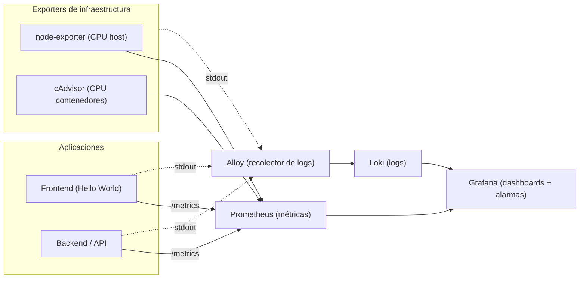

# Monitoreo Grafana, Prometheus y Loki

**Curso:** Infraestructura como Código

**Estudiante:** Mariños Gonzalez Bryan

---

## 1. Arquitectura del laboratorio



---

## 2. Prerrequisitos

- **Docker** y **Docker Compose** instalados y funcionando (`docker --version`, `docker compose version`).
- Un navegador web.
- Los archivos del proyecto entregados por el docente (carpeta del laboratorio con su `docker-compose.yml`).
- Puertos libres en tu máquina: `3000`, `3001`, `3100`, `8080`, `8081`, `9090`, `9100`, `12345`.

---

## 3. Instrucciones para ejecución

### Paso 1 — Levantar el stack

   Desde la carpeta del proyecto:

   ```bash
   docker compose up -d --build
   ```

   Una vez los contenedores esten marcados como "Pulled", luego se verifica el estado:

   ```bash
   docker compose ps
   ```

   En los servicios se debe contemplar lo siguiente:

   | Servicio   | URL                       | Qué deberías ver                        |
   |------------|---------------------------|-----------------------------------------|
   | Frontend   | http://localhost:8080     | Página "Hello World" con dos botones    |
   | Backend    | http://localhost:3001/metrics | Texto de métricas en formato Prometheus |
   | Grafana    | http://localhost:3000     | Login (usuario `admin`, clave `admin`)  |
   | Prometheus | http://localhost:9090     | Interfaz de Prometheus                   |

 ---

### Paso 2 — Ingresar a Grafana
Usar las credenciales por defecto:
- User: admin
- Pass: admin

---

### Paso 3 — Verificar el dashboard

Ingresar: **Dashboards → Evaluation → Observabilidad - Bryan Mariños**
Se deben de observar 4 paneles:
- CPU backend (%)
- CPU host (%)
- Logs de aplicación
- Logs de infraestructura

### Paso 4 — Verificar estado de alerta
Nos dirigimos al frontend desde el navegador y presionamos el boton ``Generar carga de CPU (30s)``

Ahora nos vamos a: **Alerting → Alert rules**

La alerta debe pasar de **Normal → Pending → Firing → Normal(Una vez finaliza la carga)**

---

### Paso 5 — Ver log de la alerta

Ahora volveremos a el Dashboard en el panel de `logs de aplicacion` debe de visualizarse un mensaje que contenga: **grafana_alert_received**

---
## 4. Comandos utilizados
```bash
docker compose up -d --build     # levantar / reconstruir
docker compose ps                # estado de los servicios
docker compose logs -f grafana   # seguir logs de un servicio
docker compose down              # detener (conserva dashboards)
docker compose down -v           # detener y borrar todos los datos
```
---
## 5. Preguntas a responder

**1. ¿Por qué necesitamos Loki además de Prometheus si ya tenemos `/metrics`?**

Porque no se encargan de lo mismo, Prometheus te brinda el que esta pasando, ya que solo entiende numeros, pero no nos dice el motivo solo brinda la métrica. En cambio Loki almacena texto completo y dice el por qué esta pasando un evento, mostrando un log completo. Sin Loki tendriamos que estar adivinando que causó un pico en la grafica.

**2. ¿Qué ventaja aporta que las fuentes de datos de Grafana estén aprovisionadas como código y no creadas a mano?**

Permite la reproducibilidad y la automatización, ya que en caso se destruya el entorno o se lleva a produccion, el stack siempre se levanta listo para usarse, no se depende de la intervencion humana. Además de poder trabajar en un mismo entorno con un equipo de trabajo, teniendo control sobre las versiones en git, detectando errores tempranos.

**3. El panel "CPU contenedor" y el panel "CPU host" pueden mostrar valores muy distintos. ¿Por qué? ¿Cuál usarías para alertar sobre una aplicación concreta?**

Muestran valores distintos porque el CPU host representa el uso total de la maquina fisica, mientras que CPU contenedor unicamente representa el uso de ese contenedor de forma aislada, por eso es que se puede tener un valor alto en CPU contenedor y un valor bajo en CPU host. Para alertar lo mejor es CPU contenedor ya que con la del host se puede disparar la alarma por un proceso externo a la API generando un falso positivo.

**4. ¿Qué diferencia hay entre el *evaluation interval* y el *pending period* de una alarma?**

Evaluation interval representa cuanto tiempo Grafana ejecuta la consulta de Prometheus para revisar si la condicion se esta cumpliendo. Mientras que pending period representa el tiempo que la condicion debe de mantener de forma continua hasta que pase a estado Firing. Esto es vital para evitar que micro-picos de procesamiento te llenen el correo de alertas inútiles.